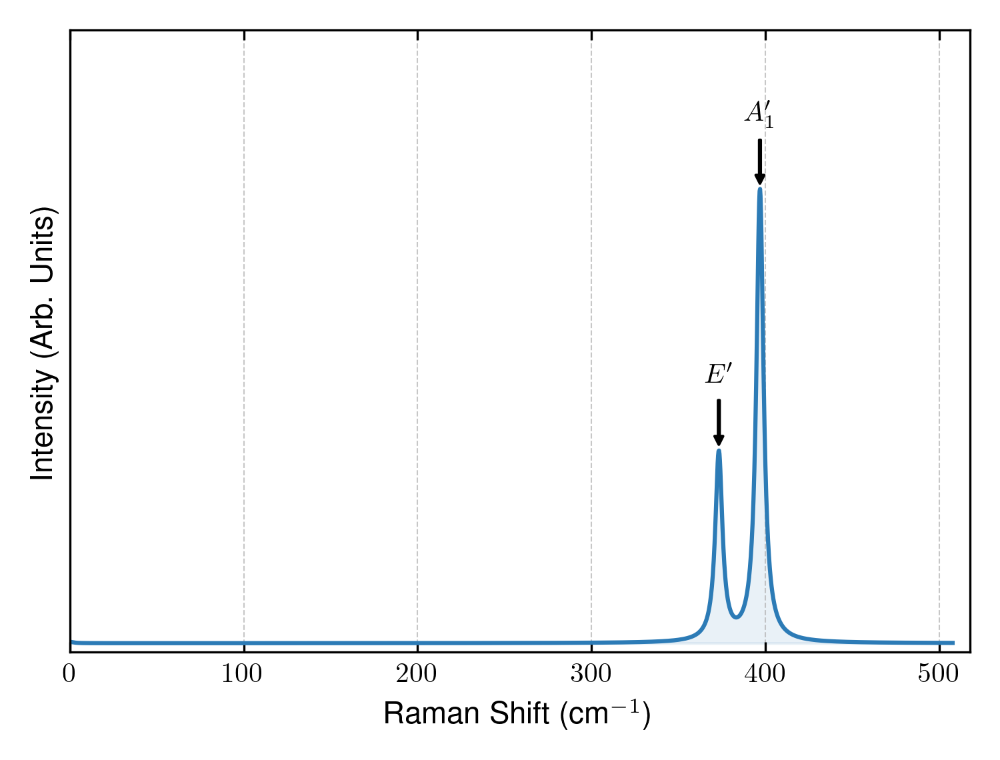

# SpectroPy

SpectroPy is a Python toolkit for predicting Raman spectra from first-principles
calculations with the Placzek approximation. It prepares finite-displacement
structures, uses Phonopy symmetry information to reduce and reconstruct the
required dielectric-tensor derivatives, and combines those derivatives with
phonon eigenvectors to produce Raman tensors, intensities, and broadened plots.

SpectroPy does **not** run VASP, Quantum ESPRESSO, or another DFT engine. You
run the displaced-structure calculations with your own DFT settings, scheduler,
and convergence parameters; SpectroPy handles the preparation and analysis.
VASP is the currently implemented output reader. Quantum ESPRESSO support is a
future goal.



## Features

- Generates finite-displacement `POSCAR` files from a relaxed `CONTCAR`.
- Optionally uses Phonopy to generate a symmetry-reduced displacement set.
- Prepares one calculation directory per displacement without prescribing a
  VASP execution method.
- Collects VASP `vasprun.xml` outputs and calculates complex,
  frequency-dependent dielectric-tensor derivatives.
- Reconstructs unmeasured directions and symmetry-equivalent atoms from
  phonon symmetry operations.
- Builds per-mode Raman tensors and intensities for specified and
  orientation-averaged experimental geometries.
- Produces Lorentzian- or Gaussian-broadened Raman plots.
- Generates VMD or VESTA phonon-mode visualizations.

## Installation

Install from a checkout:

```bash
python -m pip install .
```

Core dependencies are Python 3.9+, NumPy, and PyYAML. To use Phonopy-based
minimal displacements and plotting, install the optional dependencies:

```bash
python -m pip install '.[all]'
```

VASP is an external, proprietary prerequisite. You also need a Phonopy
calculation containing Gamma-point modes (`q-position: [0, 0, 0]`).

## Command-line interface

The installed `spectropy` command runs existing workflow stages in the current
directory. Use `--workdir` (or `-C`) to run a stage elsewhere.

```bash
spectropy --help
spectropy displacements --mode minimal --workdir /path/to/calculation
```

| Command | Purpose |
| --- | --- |
| `spectropy displacements --mode full` | Create the full `+/-x`, `+/-y`, `+/-z` set for every atom and VASP-ready directories. |
| `spectropy displacements --mode atoms` | Create the full `+/-x`, `+/-y`, `+/-z` set for symmetry-inequivalent atoms only. |
| `spectropy displacements --mode minimal` | Create Phonopy's minimum symmetry-reduced displacement set. |
| `spectropy derivatives` | Process Phonopy symmetry, then read VASP dielectric data and write frequency-dependent dielectric derivatives. |
| `spectropy static-derivatives` | Calculate static dielectric derivatives. |
| `spectropy spectrum` | Combine `band.yaml` and derivatives into Raman tensors and intensities. |
| `spectropy plot` | Interactively broaden and plot generated Raman intensities. |

The CLI intentionally preserves the scripts' current interactive prompts and
input/output file conventions. The original scripts can still be run directly,
which is useful for options not yet forwarded by the CLI, for example:

```bash
python generate_minimal_displacements.py --amplitude 0.03 --template-dir inputs
python visualize_modes.py
```

## Raman workflow

The following workflow starts from a relaxed crystal structure. The
[`MoS2_Tutorial`](MoS2_Tutorial/README.md) directory provides an example.

### 1. Prepare a calculation directory

Create a directory containing:

1. A relaxed VASP structure named `CONTCAR`.
2. Phonopy's Gamma-point `band.yaml` and, optionally, `irreps.yaml`.
3. Phonopy's YAML `symmetry` output when using symmetry-reduced displacements
   or derivative reconstruction.
4. The DFT inputs to reuse for every displacement: normally `INCAR`,
   `KPOINTS`, and `POTCAR` for VASP.

### 2. Generate displacement structures

```bash
# Full finite-difference set: every atom in +/- Cartesian directions.
spectropy displacements --mode full

# Full +/- Cartesian set, but only one atom from each symmetry-equivalent set.
# Requires Phonopy's `symmetry` file.
spectropy displacements --mode atoms

# Symmetry-reduced set (requires Phonopy).
spectropy displacements --mode minimal
```

The full mode writes `ref_poscar.vasp` and `displacements.dat`, creates
`poscar_*` files and `raman_poscar_*` directories with `POSCAR`, and provides
helper scripts `setup_vasp_calcs.sh` and `collect_results.sh`. It links
`INCAR`, `KPOINTS`, and `POTCAR` from the calculation directory into each
displacement directory.

The minimal-displacement route directly creates `raman_poscar_*` directories,
each containing a displaced `POSCAR`, and writes compatible
`ref_poscar.vasp` and `displacements.dat` files. Pass `--template-dir` to its
Python script if those directories should receive copies of VASP input files.

The `atoms` mode is the intermediate option used by the Raman pipeline's
symmetry displacement generator: it retains all six `+/-x`, `+/-y`, `+/-z`
finite differences but generates them only for symmetry-inequivalent atoms.
It requires Phonopy's YAML `symmetry` file and reconstructs the remaining
atoms during the derivative stage.

### 3. Run DFT calculations

Run your DFT code in every `raman_poscar_*` directory. SpectroPy does not
choose your functional, k-point mesh, dielectric settings, executable, or job
submission strategy. For the VASP frequency-dependent workflow, each completed
directory must contain `vasprun.xml` with dielectric-function data at the
requested laser energy.

### 4. Process symmetry and dielectric derivatives

```bash
spectropy derivatives
```

This command processes Phonopy's `symmetry` file, then prompts for the laser
frequency in eV. It copies
`raman_poscar_*/vasprun.xml` into `vasprun/`, then writes:

- `EPSILON_<frequency>.dat`: dielectric tensor log for each displacement.
- `dielectric_derivatives_<frequency>`: complex dielectric-tensor derivatives
  for all atoms, including symmetry-reconstructed data where applicable.

For static dielectric tensors, use `spectropy static-derivatives` instead.

### 5. Calculate the Raman spectrum

```bash
spectropy spectrum
```

This command reads `band.yaml`, an available `dielectric_derivatives_<frequency>`
file, and `irreps.yaml` when present. It prompts for the experimental geometry
unless an `input` file is provided, then writes:

- `Raman_tensor.dat`: complex Raman tensor for each vibrational mode.
- `Raman_intensity_specific.dat`: frequency, intensity, and representation for
  the requested polarization geometry.
- `Raman_intensity_averaged.dat`: orientation-averaged/powder intensities.

To predefine the geometry, create `input` as follows:

```text
1.0 0.0 0.0   ! incident-light polarization
0.0 1.0 0.0   ! scattered-light polarization
z             ! surface-normal direction
```

### 6. Broaden and plot results

```bash
spectropy plot
```

The plotter prompts for a full width at half maximum and for Lorentzian or
Gaussian broadening. It scans the current directory tree for Raman intensity
files and writes publication-style PNG plots alongside them. If LaTeX is
installed it is used for rendering; otherwise Matplotlib's standard fonts are
used.

## Energy scans

`run_energy_scan.sh` automates the interactive frequency prompt for a range of
laser energies. Make it executable and run it from the calculation directory:

```bash
chmod +x run_energy_scan.sh
./run_energy_scan.sh
```

It generates separate `EPSILON_<frequency>.dat` and
`dielectric_derivatives_<frequency>` files. Run the spectrum stage for each
derivative file you want to analyze.

## Phonon-mode visualization

`visualize_modes.py` generates VMD, VESTA, or both kinds of visualization
files from the phonon modes. For VESTA, first open `CONTCAR` in VESTA and save
a project file such as `template.vesta` in the calculation directory.

```bash
python visualize_modes.py
```

The script prompts for arrow scaling, output format, and—when needed—the VESTA
template. It creates `VESTA_MODES` and/or `VMD_MODES`. To load a VMD mode:

```tcl
source VMD_MODES/mode_001.vmd
```

## Citation

If you use SpectroPy in your research, please cite:

> **Raman Digital Twin of Monolayer Janus Transition Metal Dichalcogenides**
> Johnathan Kowalski and Liangbo Liang
> *ACS Applied Materials & Interfaces* (2025), Article ASAP.
> DOI: [10.1021/acsami.5c20316](https://doi.org/10.1021/acsami.5c20316)

```bibtex
@article{SpectroPy_Janus2025,
  author = {Kowalski, Johnathan and Liang, Liangbo},
  title = {Raman Digital Twin of Monolayer Janus Transition Metal Dichalcogenides},
  journal = {ACS Applied Materials \& Interfaces},
  year = {2025},
  note = {Article ASAP},
  doi = {10.1021/acsami.5c20316},
  url = {https://doi.org/10.1021/acsami.5c20316}
}
```

## License

SpectroPy is released under the [MIT License](LICENSE).
